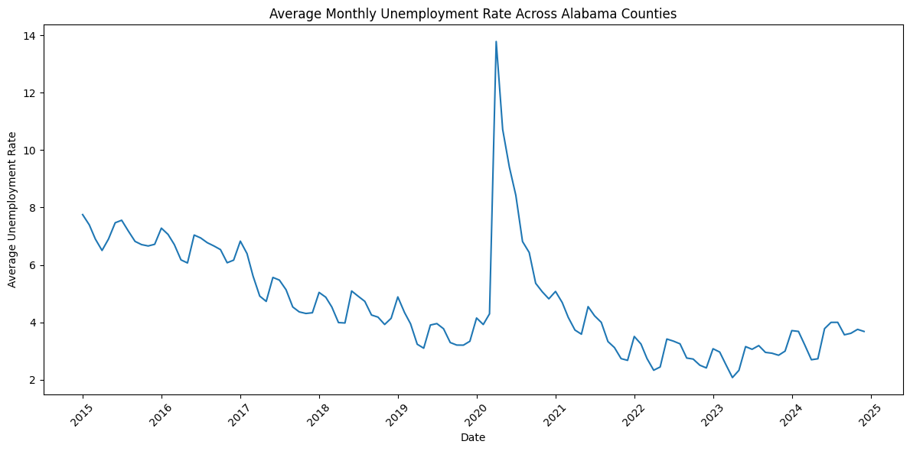
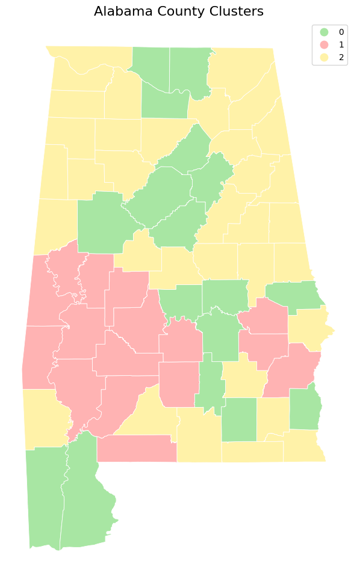

# 📊 Machine Learning Analysis of Labor Market Inequality in Alabama

## 🚀 Project Overview
This project investigates **structural inequality across Alabama counties** and analyzes how different regions responded to the **COVID-19 labor market shock** using machine learning techniques.

---

## 🎯 Key Questions
- Do structurally different counties experience labor shocks differently?
- Can socioeconomic variables predict unemployment trends?
- Where do machine learning models fail?

---

## 📊 Data Sources
- ACS (income, poverty)
- LAUS (unemployment)
- CBP (industry structure)

📅 Time Range: **2015 – 2024**

---

## 📉 COVID-19 Shock Analysis

The figure below shows the **average unemployment trend across Alabama counties**, highlighting a sharp spike during the COVID-19 shock in 2020.

👉 Insight:
- Sudden spike (~14%) during COVID
- Uneven recovery across counties
- Evidence of structural vulnerability

---

## 🧠 Clustering Analysis

Counties were grouped using **K-means clustering** based on socioeconomic and industrial features.

👉 Cluster Interpretation:
- **Cluster 0 (Green)**: Stable regions
- **Cluster 1 (Red)**: Distressed regions
- **Cluster 2 (Yellow)**: Transitional / mixed economies

---

## 🤖 Predictive Modeling
- Random Forest
- XGBoost

👉 Goal:
Predict unemployment rate using structural variables

---

## 📈 Key Findings
- Structural inequality leads to different labor market responses
- Distressed regions show slower recovery
- Median income & poverty rate are key predictors
- ML models struggle in high-unemployment regions

---

## 📄 Research Paper
👉 [Download Full Paper](./paper/Structural_Inequality_Alabama.pdf)

---

## 💻 Notebook
👉 [Run Analysis in Google Colab](https://colab.research.google.com/drive/1tzEG7j1RC7esAK25Xyn6z5sG04iNIuX0?usp=sharing)

---

## 🛠 Tech Stack
Python, Pandas, Scikit-learn, XGBoost, Matplotlib

---

## 🌎 Why This Matters
This project shows how **data science can inform economic policy**, while also revealing the **limitations of ML in real-world systems**.

---

## 👩‍💻 Author
Soyeon Hwang  
M.S. Computer Science @ Jacksonville State University
